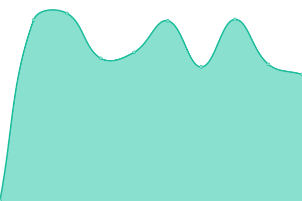

# [📈 Live Status](https://zuko-xdev.github.io/status): <!--live status--> **🟧 Partial outage**

This repository contains the open-source uptime monitor and status page for [❄❄ ℤ ｐｒｏｇｒａｍｉｎｇ ❄❄](http://zuko.pro/), powered by [Upptime](https://github.com/upptime/upptime).

With [Upptime](https://upptime.js.org), you can get your own unlimited and free uptime monitor and status page, powered entirely by a GitHub repository. We use [Issues](https://github.com/zuko-xdev/status/issues) as incident reports, [Actions](https://github.com/zuko-xdev/status/actions) as uptime monitors, and [Pages](https://zuko-xdev.github.io/status) for the status page.

<!--start: status pages-->
<!-- This summary is generated by Upptime (https://github.com/upptime/upptime) -->
<!-- Do not edit this manually, your changes will be overwritten -->
<!-- prettier-ignore -->
| URL | Status | History | Response Time | Uptime |
| --- | ------ | ------- | ------------- | ------ |
|  [Zuko HTTP GET](https://ps1787.zuko.pro) | 🟩 Up | [zuko-http-get.yml](https://github.com/ultra-bugs/status/commits/HEAD/history/zuko-http-get.yml) | 

 610ms
     
 | 

<a href="https://zuko-xdev.github.io/status/history/zuko-http-get">100.00%</a>
    

|  [Zuko HTTP POST](https://ps1787.zuko.pro) | 🟩 Up | [zuko-http-post.yml](https://github.com/ultra-bugs/status/commits/HEAD/history/zuko-http-post.yml) | 

 249ms
     
 | 

<a href="https://zuko-xdev.github.io/status/history/zuko-http-post">100.00%</a>
    

|  Zuko WS | 🟥 Down | [zuko-ws.yml](https://github.com/ultra-bugs/status/commits/HEAD/history/zuko-ws.yml) | 

 0ms
     
 | 

<a href="https://zuko-xdev.github.io/status/history/zuko-ws">0.00%</a>
    

<!--end: status pages-->

[**Visit our status website →**](https://zuko-xdev.github.io/status)

## 📄 License

- Powered by: [Upptime](https://github.com/upptime/upptime)
- Code: [MIT](./LICENSE) © [❄❄ ℤ ｐｒｏｇｒａｍｉｎｇ ❄❄](http://zuko.pro/)
- Data in the `./history` directory: [Open Database License](https://opendatacommons.org/licenses/odbl/1-0/)
