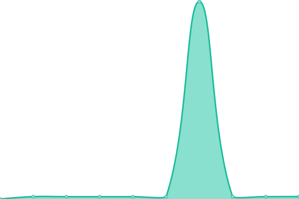
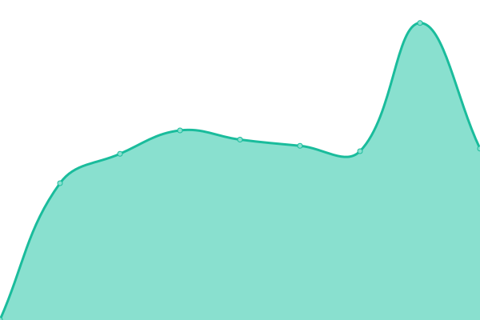

# [📈 Live Status](https://ultra-bugs.github.io/status): <!--live status--> **🟩 All systems operational**

This repository contains the open-source uptime monitor and status page for [❄❄ 𝔘𝔩𝔱𝔯𝔞 𝔅𝔲🅶ȥ ❄❄](http://zuko.pro/), powered by [Upptime](https://github.com/upptime/upptime).

With [Upptime](https://upptime.js.org), you can get your own unlimited and free uptime monitor and status page, powered entirely by a GitHub repository. We use [Issues](https://github.com/ultra-bugs/status/issues) as incident reports, [Actions](https://github.com/ultra-bugs/status/actions) as uptime monitors, and [Pages](https://ultra-bugs.github.io/status) for the status page.

<!--start: status pages-->
<!-- This summary is generated by Upptime (https://github.com/upptime/upptime) -->
<!-- Do not edit this manually, your changes will be overwritten -->
<!-- prettier-ignore -->
| URL | Status | History | Response Time | Uptime |
| --- | ------ | ------- | ------------- | ------ |
|  [Zuko's Main Server [GET]](https://zuko.pro) | 🟩 Up | [zuko-s-main-server-get.yml](https://github.com/ultra-bugs/status/commits/HEAD/history/zuko-s-main-server-get.yml) | 

 727ms
     
 | 

<a href="https://ultra-bugs.github.io/status/history/zuko-s-main-server-get">91.85%</a>
    

|  [Zuko's Main Server [POST]](https://zuko.pro) | 🟩 Up | [zuko-s-main-server-post.yml](https://github.com/ultra-bugs/status/commits/HEAD/history/zuko-s-main-server-post.yml) | 

 316ms
     
 | 

<a href="https://ultra-bugs.github.io/status/history/zuko-s-main-server-post">92.01%</a>
    

|  [Lalita landing webpage](https://lalitadesignqni.com) | 🟩 Up | [lalita-landing-webpage.yml](https://github.com/ultra-bugs/status/commits/HEAD/history/lalita-landing-webpage.yml) | 

 1709ms
     
 | 

<a href="https://ultra-bugs.github.io/status/history/lalita-landing-webpage">91.44%</a>
    

<!--end: status pages-->

[**Visit our status website →**](https://ultra-bugs.github.io/status)

## 📄 License

- Powered by: [Upptime](https://github.com/upptime/upptime)
- Code: [MIT](./LICENSE) © [❄❄ 𝔘𝔩𝔱𝔯𝔞 𝔅𝔲🅶ȥ ❄❄](http://zuko.pro/)
- Data in the `./history` directory: [Open Database License](https://opendatacommons.org/licenses/odbl/1-0/)
